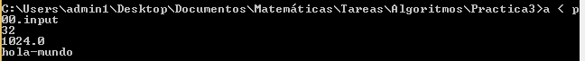
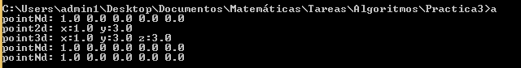

# Práctica 3

### Tulio Muñoz Magaña

## Marco teórico. 

La programación orientada a objetos es un paradigma de programación que se basa en abstraer estructuras que almacenan información y realizan procedimientos, con el objetivo de reusar el código creando diversas instancias de un determinado objeto. Esto a su vez le da una mejor estructuración al código, permitiéndonos identificar los módulos separados que lo conforman. La principal ventaja frente al paradigma de programación procedural es que incluye una especie de intuición humana ya que hay una directa relación entre el funcionamiento de los objetos del código y nuestra noción cotidiana de objeto (tienen atributos y se hacen cosas con ellos).  

El término *upcasting* hace referencia a utilizar los atributos de un objeto heredados de una clase padre, de esta forma podemos tener una clase más general qu tiene algunas características, y varios objetos más particulares que tienen algunas características extra, pero siempre pueden recurrir a las características de la clase a la que heredan. 

## Descripción de los programas.

Se han entregado dos programas:

Programa `p00.cpp`:

Este programa recibe un entero indicando el número de operaciones que se van a realizar, existen 3 operaciones. Luego se indica la operación y la información requerida para cada una de la siguiente forma:

| Operación | Argumentos                                | Resultado
|-------    |-------------------------------------------|-------
| `suma`    | Dos números enteros `a` y `b`             | r = a+b
| `pow`     | Dos números flotantes `b` y `p`           | r = b^p
| `concat`  | Un entero `len` seguido de `len` palabras | r =  b_1 ... b_len 

Ejemplo de entrada

> ```
> 2 
> pow 2 4 
> concat 5 s we r t y  
> ```

Salida:

> ```
> 16
> swerty
> ```

La entrada de ejemplo que se ha proporcionado es la siguiente
> ```
> 3
> suma 10 22
> pow 2.0 10
> concat 3 hola - mundo
> ```

Los siguientes son los comandos de compilación y ejecución respectivamente:
> ```
> g++ -std=c++11 p00.cpp
> ./a < p00.input
> ```

La siguiente es una captura de la salida de `p00.cpp` al recibir de entrada el archivo proporcionado, es la misma que la salida esperada.  
  
Se ha escrito la salida en el archivo `p00.output`.


Programa `p04.cpp`:

Este programa realiza una abstracción del concepto de punto n-dimensional, y crea dos estructuras que heredan de la original, una para puntos en 2 dimensiones y otra para puntos en 3 dimensiones, las 3 estructuras tienen un método `to_s()` para escribir en punto en un string y poder imprimirlo, en cada estructura se adapta el método a las respectivas dimensiones. 

Posteriormente crea una estructura que abstrae un arreglo de puntos, que tiene métodos para extraer el apuntador de un elemento específico del arreglo, para cambiar el apuntador asignado a un elemento del arreglo, y para evaluar una función que se pasa como parámetro en todos los puntos del arreglo. 

La función main crea un arreglo de 5 puntos con diferentes características y los obtiene en un string con el método `to_s()`, para después imprimirlos.

El programa no tiene entrada. 

Comandos de compilación y ejecución respectivamente:
> ```
> g++ -std=c++11 p04.cpp
> ./a
> ```

La siguiente es una captura de la salida de `p04.cpp`. Es la misma que la salida esperada. 
  
Se ha escrito la salida en el archivo `p04.output`.


## Conclusión

Se ha logrado obtener los mismos resultados que las salidas esperadas. Las herramientas de la herencia y el polimorfismo son muy útiles, y podemos encontrar aplicaciones por ejemplo al crear una clase `grafo` que contenga las características de una gráfica y algunos métodos como buscar su número cromático o insertar aristas. Y podemos generar clases que hereden de esta clase, como `arbol`, cuyo número de aristas ya está determinado, y puede contener algún algoritmo de búsqueda en árbol. O por ejemplo una clase `grafoBipartito`, que puede contener información extra como el número de nodos en cada lado.  

## Problemas encontrados

Lo más desafiante al resolver la práctica ha sido la aplicación de los nuevos conceptos y sobre todo el uso de la palabra clave `this`. 

## Referencias

* Bruce Eckel, "Thinking in c++, colume 1, 2nd Edition", p23-46
* https://en.cppreference.com/w/
* https://www.learncpp.com/cpp-tutorial/basic-inheritance-in-c/
* https://www.programarya.com/Cursos/C++/Entrada-y-Salida-de-Datos
* https://www.geeksforgeeks.org/polymorphism-in-c/
* https://www.tutorialspoint.com/cplusplus/cpp_classes_objects.htm
* http://faculty.cs.niu.edu/~hutchins/csci241/output.htm
* https://docs.github.com/en/github/writing-on-github/creating-and-highlighting-code-blocks
* https://www.bogotobogo.com/cplusplus/upcasting_downcasting.php
* https://www.cplusplus.com
* https://www.youtube.com/watch?v=Ug50xmm6TdU&feature=emb_logo
* https://www.youtube.com/watch?v=rsty4T9mTTY&feature=emb_logo