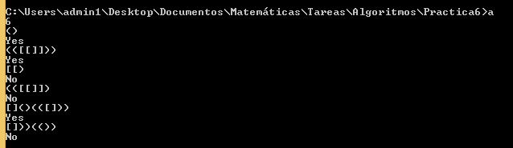
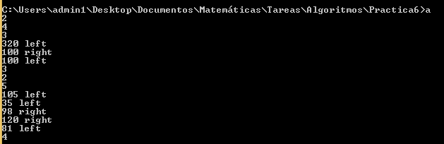

# Práctica 6

## Tulio Muñoz Magaña

## Marco teórico

La pila es una estructura de datos en la cual se tiene una serie de elementos, los cuales se van acomodando en el orden en el que ingresan a la pila, sin embargo, el orden en el que salen de la pila es el orden inverso del orden en el que entraron a la pila. Es decir, la pila es una estructura LIFO (Last in, first out), la pila puede ser implementada ya sea con arreglos o con listas ligadas. 

La cola es una estructura de datos en la cual se tiene una serie de elementos, de manera que los elementos se van acomodando en el orden en el que van entrando, y en ese mismo orden salen. Es decir, la cola es una estructura de datos FIFO (First in, first out). La cola también puede ser implementada tanto con arreglos como con listas ligadas, la implementación con arreglos tiene la particularidad de que con el fin de conservar el uso del espacio asignado desde el comienzo para la cola, los nuevos elementos se van agregando de forma circular en el arreglo, es decir que si se ha llegado al final del arreglo y se quiere agregar otro elemento, se agrega al principio del arreglo. 

## Descripción de los programas

El archivo `p00.cpp` contiene una implementación usando una lista ligada de una estructura de Pila, la cual contiene un apuntador `head` apuntando a la cabeza de la pila y los métodos:

|Operación   | Complejidad | Descripción
|---|---|---
|`push(v)`   | O(1)        | inserta el valor `v` a la pila
|`pop()`     | O(1)        | elimina el último valor añadido a la pila
|`top()`     | O(1)        | regresa el valor `v` del último elemento añadido a la pila
|`isempty()` | O(1)        | regresa `true` si la pila está vacía, `false` en caso contrario

La lista ligada usada se realizó con estructuras `Nodo<T>` que contienen una variable `val` del tipo `T` que contiene la información del nodo y un apuntador `next` que apuntará al siguiente nodo en la lista. La pila se ha implementado de forma que `head` siempre apunta al elemento que está al tope de la pila o es un apuntador nulo si la pila está vacía. 

Para la operación `push()`, se crea un nuevo nodo y se redirecciona `head` a este nuevo nodo, que apuntará al nodo que antes era la cabeza. Para `pop()` se redirecciona `head` y se crea un apuntador a Nodo `aux` que almacenará la dirección de la antigua cabeza para poder liberar la memoria. Para `top()` se estrae la información que se encuentra en el nodo de la cabeza y para `isempty()` se regresa `true` si `head` es el apuntador nulo y `false` si no. 

El archivo `p01.cpp` contiene una implementación usando una lista ligada de una estructura de Cola, la cual contiene un apuntador `head` apuntando a la cabeza de la cola y un apuntador `tail` apuntando al final de la cola. Si la cola está vacía, estos dos apuntadores son nulos. La estructura contiene los métodos:

|Operación    | Complejidad  | Descripción
|---|---|---
|`enqueue(v)` | O(1)         | inserta el valor `v` en la cola 
|`dequeue()`  | O(1)         | elimina el primer valor añadido a la cola
|`next()`     | O(1)         | regresa el valor `v` del siguiente valor en la cola
|`last()`     | O(1)         | regresa el valor `v` del último valor de la cola
|`isempty()`  | O(1)         | regresa `true` si la cola está vacía, `false` en caso contrario

La lista ligada usada se realizó también con estructuras `Nodo<T>` que contienen una variable `val` del tipo `T` que contiene la información del nodo y un apuntador `next` que apuntará al siguiente nodo en la lista. El elemento al que apunta `head` es el elemento próximo a salir de la Cola con `dequeue()` y al que se alude en `next()`, mientras que el apuntador `tail` apunta al nodo al que se puede acceder con `last()`, a su vez de que es el nodo al que se adjuntará un nuevo nodo con `enqueue()`. 

`dequeue()` está implementado como `pop()` en la pila e `isempty()` está implementado de la misma forma en ambas estructuras. Para `enqueue()` se crea un nuevo nodo que contendrá al nuevo elemento, y se redirecciona el apuntador del que antes era el último elemento a este nuevo nodo.  

El programa `p02.cpp` recibe strings que contienen los caracteres `'('`, `')'`, `'['` y `']'`. Luego determina si la cadena recibida es una cadena correcta, es decir, si los paréntesis y corchetes que se abren también se cierran, que no se cierren corchetes o paréntesis no abiertos, y que no ocurran intersecciones como la siguiente: `"[(])"`. 

El programa recibe un número entero indicando la cantidad de strings que se ingresarán a continuación para ser verificados, seguido de todos estos strings. 

El programa escribe en salida estandar `Yes` si el string es un string correcto y `No` si el string no es un string correcto. 

Los comandos de compilación y ejecución respectivamente son los siguientes

    g++ -std=c++11 p02.cpp
    ./a.out

Se han generado archivos `.output` con los archivos `.input` dados, en general, con el archivo `p02.input-i` se ha generado el archivo `p02.output-i` con la salida respectiva del programa. 

La complejidad para cada caso es O(k), donde k es la longitud del string proporcionado. Esto ocurre porque para este caso se realiza un bucle `for` que contiene operaciones que se realizan en tiempo constante adentro. A su vez de que contiene una llamada a `P.vaciar()`, el cual es un método que contiene un bucle `while` que realiza en el peor caso k iteraciones, por lo que tenemos un procedimiento de complejidad O(k) sumado a otro procedimiento de complejidad O(k), por lo que la complejidad total es también O(k). 

El programa `p03.cpp` resuelve el problema de determinar el número de cruces que tiene que realizar un barco para llevar filas de carros de cada lado al otro, dada la longitud del barco y las longitudes respectivas de los carros. 

El programa recibe un número entero indicando el número de casos a verificar. Posteriormente por cada caso recibe un entero que indica la longitud en metros del barco, luego otro entero indicando el número de carros que se encuentran esperando, contando ambos lados del rio, y finalmente recibe una dupla por cada carro donde el primer valor es un entero indicando la longitud del carro en centímetros y el segundo es un string que puede ser `"left"` o `"right"` indicando el lado en el que se encuentra el carro.  

El programa escribe por salida estándar el número de cruces que se han realizado para cada caso introducido. 

Los comandos de compilación y ejecución respectivamente son los siguientes

    g++ -std=c++11 p03.cpp
    ./a.out

Se han generado archivos `.output` con los archivos `.input` dados, en general, con el archivo `p02.input-i` se ha generado el archivo `p02.output-i` con la salida respectiva del programa.

La complejidad de cada caso es O(m), donde m es el número de carros del caso. 

Para verificar esto, notamos que en el código del caso, tienes operaciones que se realizan en tiempo constante junto con un bucle `for` y un bucle `while`. El bucle `for` itera m veces y contiene operaciones que se realizan en tiempo constante, por lo que tiene complejidad O(m). El bucle `while` contiene un bucle `while` anidado (partido en dos bucles `while` mutuamente exclusivos), sin embargo, vemos que el bucle `while` interior se realiza a lo más m en todas las iteraciones del bucle `while`, ya que se realiza una vez por cada carro transportado, y cada carro es transportado solo una vez. Vemos entonces que la complejidad de este bucle `while` también es O(m), a pesar de contener un bucle `while` anidado. Concluimos que la complejidad de un caso es algo de complejidad mas algo de complejidad lineal mas algo de complejidad constante, lo cual es de complejidad lineal, es decir, O(m). 

## Resultados

A continuación una captura de pantalla del programa `p02.cpp`:

A continuación una captura de pantalla del programa `p03.cpp`:

## Conclusión

Los resultados han sido los esperados, se han generado archivos `.output` que coinciden con los archivos `.expected` proporcionados. 

Implementar la pila o la cola con listas ligadas en lugar de arreglos tiene la ventaja de que ocupa espacio dinámico. Es decir que se usa únicamente el espacio necesario para el tamaño de la estructura, y se se requiere más espacio puede ser reservado, mientras que si se implementa mediante un arreglo, el tamaño de la estructura tiene que ser establecido desde el comienzo. 

Una ventaja de utilizar un arreglo para la implementación de la pila o cola es que si se tiene la certeza del tamaño necesario de la estructura, la implementación con un arreglo requiere menos espacio, ya que no necesita los apuntadores que llevan de un nodo al siguiente en el caso de la lista ligada. 

## Problemas encontrados

Se han tenido problemas con la declaración de un nodo de la forma `Nodo<T> N(val);` en el método `enqueue()` de una cola, ya que sucedían cosas extrañas con el apuntador `head` de la cola. Se ha optado por utilizar la declaración `Nodo<T>* N = new Nodo(val);`, la cual ha funcionado correctamente.   

## Referencias

* Eckel, B. (2000). Thinking in C++. Upper Saddle River, NJ: Prentice Hall.
* https://www.geeksforgeeks.org/templates-cpp/
* https://www.repl.it/
* https://www.tablesgenerator.com/markdown_tables
* https://www.geeksforgeeks.org/delete-in-c/
